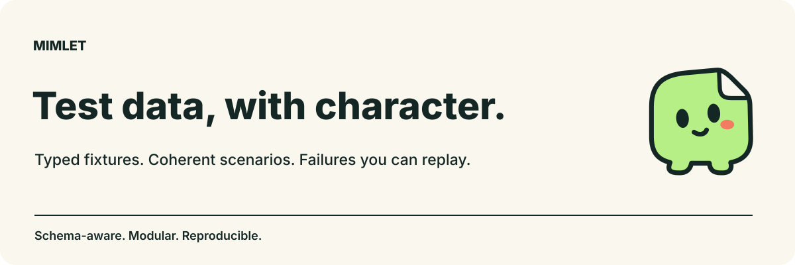

# Mimlet



Typed fixtures. Coherent scenarios. Failures you can replay.

Mimlet is the schema-aware toolkit behind `@mimlet/core`, `@mimlet/*`, and the
`hey-api-builders` integration. The new package names are a **source preview**;
npm publication is pending. The [documentation website](https://jeffreynijs.github.io/mimlet/) is live.

A modular TypeScript toolkit for reproducible test data: immutable builders,
schema-driven generation, native validation and codecs, related fixtures,
property-based testing, and generated fluent classes. **Hey API is one integration,
not a prerequisite.** The schema-free core has no runtime or peer dependencies.

This repository prepares the **0.1.0-alpha.0** toolkit and **3.0.0-alpha.0** Hey API
integration. These are source versions, not a statement that packages have been
published. The repository root is private; individual packages are independently
packable. The existing published Hey API v2 package is unchanged.

## Start with the smallest interface you need

### An existing factory

```ts
import { createBuilder } from '@mimlet/core';

interface User {
  id: string;
  role: 'reader' | 'admin';
  notes: string[];
}
const users = createBuilder((id: string): User => ({ id, role: 'reader', notes: [] }));
const admins = users.with({ role: 'admin' });
const ada = admins.build('user-1');
const baseline = users.build('user-2'); // Still a reader; configuration is immutable.
```

Factories retain their arguments. Async factories and explicit async transforms
expose async build methods. Patches are shallow; changing a union variant requires
complete replacement or explicit schema-aware selection. Fresh override factories
and opt-in cloning avoid accidentally shared nested fixture data.

### A native TypeBox schema

```ts
import Type from 'typebox';
import { fromTypeBox, fromTypeBoxVariant } from '@mimlet/typebox';

const Timestamp = Type.Codec(Type.Number())
  .Decode((value) => new Date(value))
  .Encode((value) => value.getTime());
const Event = Type.Object({ id: Type.String({ default: 'one' }), at: Timestamp });
const events = fromTypeBox(Event);
const input = events.with({ at: 1000 }).build(); // at: number
const output = events.with({ at: 1000 }).buildValidated(); // at: Date

const Pet = Type.Union([
  Type.Object({ kind: Type.Literal('cat'), lives: Type.Number({ default: 9 }) }),
  Type.Object({ kind: Type.Literal('dog'), bark: Type.Boolean({ default: true }) }),
]);
const quietDog = fromTypeBoxVariant(Pet, 1).with({ bark: false }).buildValidated();
```

The maintained `@sinclair/typebox` line has its own native adapter. Neither path
converts codecs to JSON or requires a second validation library. Native creation
produces checked defaults/minimal examples, not universal random generation.
[Union selection](docs/union-variants.md) preserves the original union's codecs.

### Standard Schema and JSON Schema

```ts
import { z } from 'zod';
import { fromStandardJsonSchema } from '@mimlet/json-schema';

const Person = z.object({ name: z.string().min(1), age: z.number().int().min(18).max(99) });
const people = fromStandardJsonSchema(Person);
const person = people.with({ name: 'Ada' }).buildValidated();
```

Standard Schema-compatible validators also work directly with
`createSchemaBuilder(schema, factory)`. Automatic generation additionally needs
metadata or a native generator. The standards generation path uses **input** JSON
Schema, checks candidates independently, then calls the native validator after
patches. Raw runtime JSON returns `unknown`; it does not invent application types.

Use a prepared `jsonSchemaAdapter` and its explicit session for replayable lists:

```ts
import { jsonSchemaAdapter } from '@mimlet/json-schema';

const provider = jsonSchemaAdapter(
  { type: 'integer', minimum: 1, maximum: 100 },
  { profile: 'random' }
);
const session = provider.session(42);
const before = session.snapshot();
const value = provider.create(session);
// restoreSession(before, provider.identity) reproduces this position.
```

## Packages

The core is `@mimlet/core`; optional toolkit packages use the `@mimlet/` scope. Install only the
capabilities you use; schema vendors and generation backends do not enter the core.

| Package                                                     | Purpose                                                                                                          |
| ----------------------------------------------------------- | ---------------------------------------------------------------------------------------------------------------- |
| [@mimlet/core](packages/core/README.md)                     | Immutable runtime, Standard Schema, sessions, capture, scenarios, class facades and typed paths.                 |
| [@mimlet/typebox](packages/typebox/README.md)               | Modern native TypeBox, encoded/decoded types, complete union variants.                                           |
| [@mimlet/typebox-legacy](packages/typebox-legacy/README.md) | Maintained legacy TypeBox and Transform support.                                                                 |
| [@mimlet/json-schema](packages/json-schema/README.md)       | Draft-07, 2019-09 and 2020-12 generation; standards conversion; profiles, extensions and checked negative cases. |
| [@mimlet/valibot](packages/valibot/README.md)               | Native Valibot input conversion and parsing. Zod and ArkType use the standards path directly.                    |
| [@mimlet/effect](packages/effect/README.md)                 | Native Effect 3 generation, codecs, and arbitraries/shrinkers.                                                   |
| [@mimlet/faker](packages/faker/README.md)                   | Realistic data with session-scoped random streams, locales and reference dates.                                  |
| [@mimlet/fast-check](packages/fast-check/README.md)         | Shrink-aware fixtures, properties, coherent scenarios and failure replay.                                        |
| [@mimlet/api](packages/api/README.md)                       | OpenAPI operations and AsyncAPI messages, offline references and explicit serialization.                         |
| [@mimlet/graphql](packages/graphql/README.md)               | Native GraphQL input and selection-aware response fixtures.                                                      |
| [@mimlet/protobuf](packages/protobuf/README.md)             | Lossless Protobuf values, offline imports and binary codecs.                                                     |
| [@mimlet/avro](packages/avro/README.md)                     | Native Avro values, explicit unions, 64-bit integers and binary codecs.                                          |
| [@mimlet/codegen](packages/codegen/README.md)               | Standalone classes/CLI, deterministic output, non-mutating checks and canonical self-contained runtime.          |
| [@mimlet/playground](packages/playground/README.md)         | Local-only schema editor with replay, import/export and interruptible workers.                                   |
| [@mimlet/adapter](packages/adapter/README.md)               | Capability-based adapter SDK, inspection and reusable conformance checks.                                        |
| [@mimlet/consumers](packages/consumers/README.md)           | Preview loaders, HTTP response resolvers and explicit persistence handoff.                                       |
| [hey-api-builders](packages/hey-api-builders/README.md)     | Existing unscoped plugin identity, now emitting wrappers around the shared core.                                 |

[Compatibility](docs/compatibility.md) separates tested package versions, generation,
validation, codecs, shrinking and execution environments. It is not a blanket
promise to generate every possible refinement or support every vendor release.

## Develop and use the unpublished source

Use Node 22.18.0 or newer and the pinned pnpm 10.34.5 toolchain:

```sh
pnpm install --frozen-lockfile
pnpm build
pnpm validate
pnpm pack:check
```

After building, pack the desired package directory with `npm pack --ignore-scripts`
and install its tarball plus its declared internal dependencies in your consumer.
`pnpm release:prepare` creates the complete verified train from a clean committed
tree. It does not publish. See [release operations](docs/releases.md).

Run the local playground with
`node packages/playground/dist/cli.js`. It binds only to loopback;
closing it leaves no saved user schema on the server. Do not expose its port publicly.

## Workflows and contracts

The [shop example](examples/shop.mjs) combines native validation, realistic users,
order relationships, previews, HTTP mocks and an explicitly supplied persistence
sink. `pnpm test:examples` executes it from real installed tarballs.

[Sessions and replay](docs/sessions-and-replay.md),
[fixture capture](docs/fixture-capture.md),
[correlated scenarios](docs/correlated-scenarios.md), and
[class facades and nested paths](docs/generated-facades-and-paths.md) cover the core.
The [Hey API migration guide](docs/hey-api-migration.md) explains the breaking v3
runtime dependency; [archived v2 documentation](docs/hey-api-v2.md) remains available.

One construction pipeline is shared across direct, native and generated builders:
**generate input → apply configured patches/replacements/omissions → transform →
optionally validate/decode → return output**. Unvalidated builds remain available
for intentional negative tests. Explicit user overrides are never repaired or
silently regenerated. A native parser may still perform its own documented
normalization. See [architecture](docs/schema-independent-builders.md).

## Verification and security

CI compiles all packages, runs strict positive/negative type tests, core and native
conformance suites, independent coverage gates, package inspection, actual tarball
consumers and production-dependency audits. Separate workflows exercise Chromium,
Firefox, WebKit, Node, Bun, Deno, the minimum core compiler, recipes and performance.
They are release gates, not substitutes for each other. `pnpm test:browser` uses
installed engines; `node scripts/test-browser.mjs --install` installs pinned engines.

Schemas loaded as data never enable remote fetching or executable configuration.
Native callbacks remain trusted code. Generation budgets are bounded sampling,
not a universal solver, and worker termination is not an OS sandbox. Replay files
and fixture captures can contain private data. See [security](SECURITY.md),
[contributing](CONTRIBUTING.md), and the [acceptance record](docs/acceptance.md).
